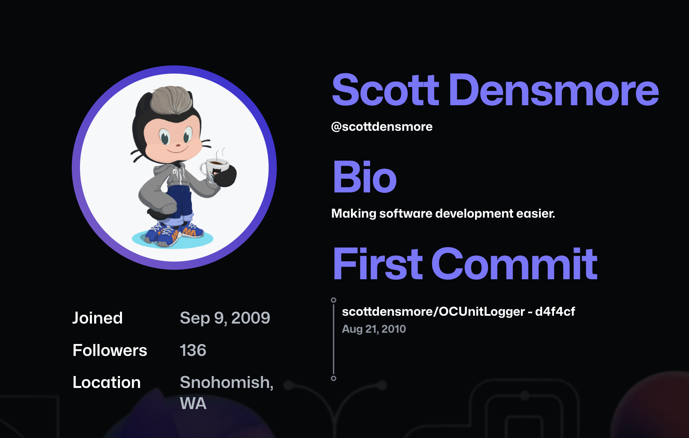

# My First Commit

A GitHub-themed web application that discovers your origin story on GitHub. Enter any username to see their first public commit and the nine that followed, beautifully connected in an activity-graph style timeline.

## What It Does

My First Commit helps you find the first public GitHub commit for any user. It searches GitHub's public commit index, shows the earliest result first, and includes the next several commits so the timeline feels like a small origin story rather than a single raw link.

The app is intentionally small: no accounts, no database, and no server-side storage of searches. Successful searches are saved only in the user's browser as recent-search shortcuts.

## Features

- **Origin Discovery:** Uses the GitHub Search API to find the earliest public commits for any user.
- **Visual Timeline:** Displays a sequence of the first 10 commits, connected by a vertical line with GitHub-style contribution squares.
- **Recent Searches:** Keeps successful searches as local browser shortcuts for quick reruns.
- **Shareable Searches:** Updates the URL with the searched username so results can be shared.
- **GitHub Aesthetic:** Fully themed with GitHub's color palette, typography, and iconography.
- **Responsive Design:** Optimized for both desktop and mobile viewing.
- **Production Checks:** Uses CI, production health checks, Vercel Analytics, and structured server logs.

## Project Links

- **Live app:** [my-first-commit-eta.vercel.app](https://my-first-commit-eta.vercel.app)
- **Development guide:** [docs/development.md](docs/development.md)
- **Production runbook:** [docs/production.md](docs/production.md)

## How It Works

The app is a Next.js App Router project. The browser collects a GitHub username, the server action queries GitHub with Octokit, and the UI renders the first commit in a GitHub-inspired timeline. Search URLs can be shared with `?user=<username>`, and recent searches are stored locally in `localStorage`.

## Tech Stack

- **Framework:** [Next.js](https://nextjs.org/) (App Router)
- **Styling:** [Tailwind CSS](https://tailwindcss.com/)
- **API Client:** [Octokit](https://github.com/octokit/octokit.js)
- **Icons:** [React Icons](https://react-icons.github.io/react-icons/)
- **Date Handling:** [date-fns](https://date-fns.org/)
- **Monitoring:** [Vercel Analytics](https://vercel.com/analytics), Vercel Logs, and GitHub Actions

## Privacy

- Usernames entered into the search field are sent to GitHub to retrieve public commit data.
- `GITHUB_TOKEN` is used only server-side and is never exposed to the browser.
- Recent searches are stored only in the user's browser under `my-first-commit:recent-searches`.
- The app does not store searches on a server.

## Limitations

- GitHub commit search can lag behind newly pushed commits.
- Only public commits indexed by GitHub are searchable; private commits are never included.
- Older commits can be missed if GitHub's public search index does not return them for the author query.
- Results depend on the author metadata GitHub exposes for public commits.

## Documentation

- Use the [development guide](docs/development.md) for local setup, environment variables, testing, and deployment commands.
- Use the [production runbook](docs/production.md) for production checks, observability, and troubleshooting.

## License

MIT
