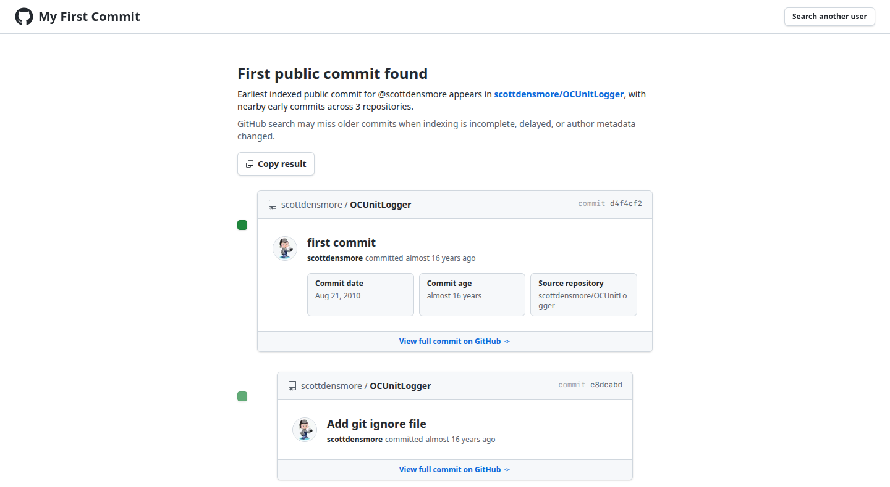

# My First Commit

[](https://github.com/scottdensmore/my-first-commit/actions/workflows/ci.yml)
[](https://github.com/scottdensmore/my-first-commit/actions/workflows/deployed-smoke.yml)
[](https://github.com/scottdensmore/my-first-commit/releases/latest)
[](LICENSE)
[](https://my-first-commit-eta.vercel.app)

Discover the beginning of a GitHub story. Enter a username to find that person's earliest public
commit and the nine commits that followed it.

**[Try My First Commit](https://my-first-commit-eta.vercel.app)**



## Why My First Commit?

A contribution graph shows how much someone has built. My First Commit shows where their public
history began, as a small, shareable timeline rather than a raw search result.

The app stays intentionally focused: there are no accounts, no database, and no app-owned search
history. Recent searches remain in the visitor's browser.

## Highlights

- Finds the earliest public commits indexed for a GitHub user.
- Presents the first ten results as an accessible, responsive timeline.
- Creates shareable search URLs and copyable result summaries.
- Keeps recent searches locally in the browser for quick reruns.
- Handles partial results, rate limits, timeouts, and upstream failures with recovery paths.

Read the [product guide](docs/product.md) for the complete feature set, data boundaries, and the
limitations of GitHub's public commit index.

## Quick Start

```bash
git clone https://github.com/scottdensmore/my-first-commit.git
cd my-first-commit
nvm use
npm ci
npm run dev
```

Open [http://localhost:3000](http://localhost:3000). The app works without credentials, but a
server-side `GITHUB_TOKEN` is recommended because unauthenticated GitHub searches have stricter
limits. See the [development guide](docs/development.md) for configuration and validation.

## Documentation

| Guide | What it covers |
| --- | --- |
| [Product](docs/product.md) | Capabilities, product boundaries, privacy, and limitations |
| [Architecture](docs/architecture.md) | Request flow, data boundaries, runtime routes, and failure handling |
| [Development](docs/development.md) | Local setup, environment variables, validation, and maintenance |
| [Production](docs/production.md) | Deployment, observability, security headers, and troubleshooting |
| [Manual QA](docs/manual-qa.md) | Responsive, metadata, and production spot checks |
| [Releases](docs/release.md) | Versioning, changelog promotion, tags, and GitHub releases |

Project changes are recorded in the [changelog](CHANGELOG.md). Coding agents should also read the
canonical [agent instructions](AGENTS.md).

## Contributing

Contributions are welcome. Read [CONTRIBUTING.md](CONTRIBUTING.md) for the branch, test, review, and
pull-request workflow, and see [CONTRIBUTORS.md](CONTRIBUTORS.md) for project acknowledgements.

## Privacy

Searches send a GitHub username to GitHub's public commit index. The app does not store searches in
a database, and analytics events exclude searched usernames. Read the
[privacy page](https://my-first-commit-eta.vercel.app/privacy) for the full visitor-facing notice.

## License

Licensed under the [MIT License](LICENSE). My First Commit is an independent project and is not
affiliated with GitHub.
